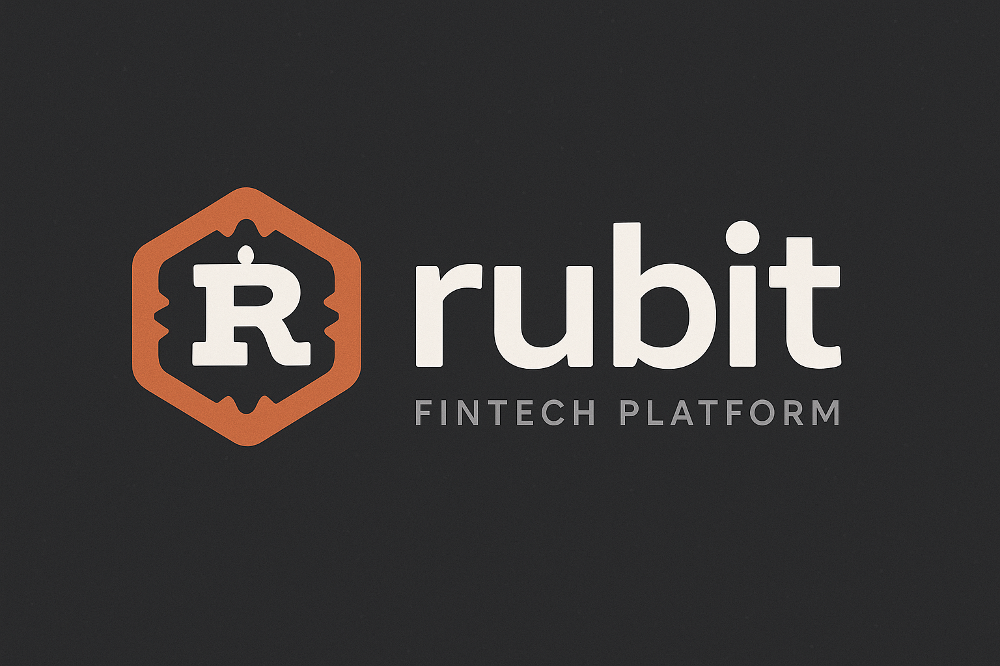

# Rubit - Fintech Platform

A simple financial technology platform written in Rust that combines:

1. An accounting system for tracking user balances
2. A trading platform with an order matching engine
3. 🚧 In progress..
